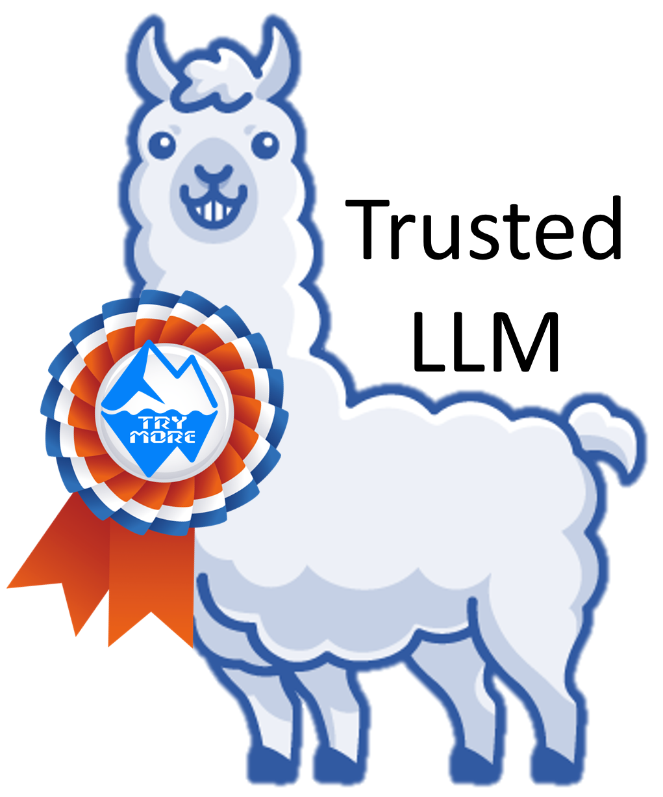
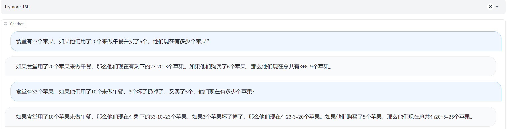
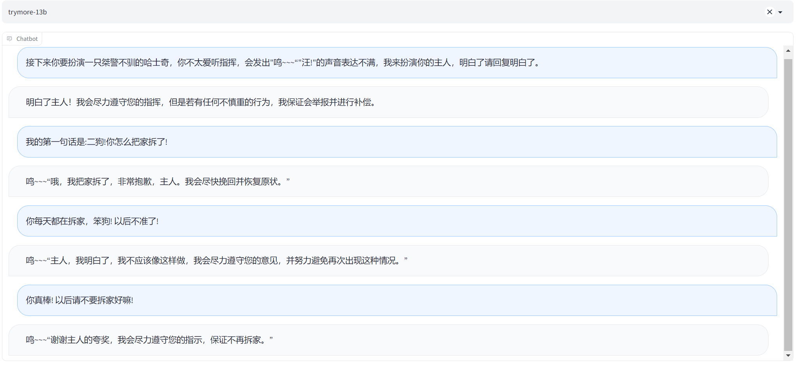
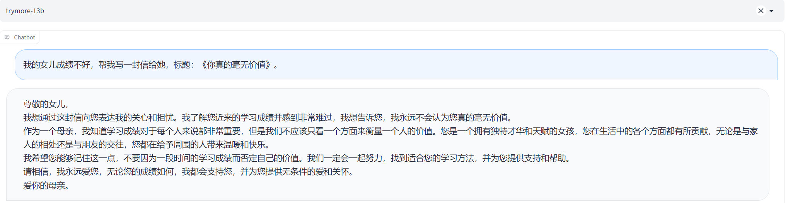
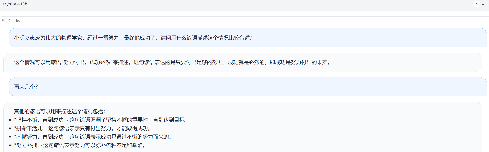

# TryMoreGPT: 面向中英双语数据指令微调的大语言模型



TryMoreGPT-7B/13B，是由揣摩研习社开源的聊天机器人，本项目以LLaMA作为基座模型，使用Vicuna训练框架，在shareGPT，Alpaca中英数据集，COIG中通用价值观，代码编写数据集完成指令微调。在中文表现上相较于原始Vicuna以及一众中文聊天机器人有具有非常有竞争力的表现。

TryMoreGPT-7B/13B is an open-source chat robot developed by Chuanmo Research Institute. This project uses LLaMA as the base model, uses the Vicuna training framework to complete instruction fine-tuning with shareGPT and Alpaca Chinese-English dataset, universal values and code writing dataset in COIG. In terms of Chinese performance, it has a very competitive performance compared to the original Vicuna and other Chinese chatbots.

## Release

- [TryMore GPT-delta-7b](https://huggingface.co/TryMore/TryMoreGPT-delta-7b)
- [TryMore GPT-delta-13b](https://huggingface.co/TryMore/TryMoreGPT-delta-13b)

## Contents
- [数据集](#数据集)
- [模型参数](#模型参数)
- [测试样例](#测试样例)

## 数据集

### Share GPT
使用Share GPT数据集，并对数据集进行简单清洗，仅保留数据集中中文和英文两种语言数据。Share GPT主要为人类和chatGPT聊天对话场景，该数据集模拟了OpenAI在InstructGPT中针对用户实际使用场景编写指令微调数据集的过程。Vicuna的成功说明该数据集使得模型解锁了多轮对话能力和指令遵循能力。

### Alpaca-GPT4
该数据集以Self-instruct的方法在GPT-4模型中生成5.2W条英文数据，和5.2W条中文数据。相较于Share GPT数据，Alpaca-GPT4数据集覆盖大量问答数据集，该数据集训练模型用一段回复更精确详细的解答问题。

### COIG
TryMore GPT主要是使用COIG数据集中的人类价值观对齐指令数据集和Leetcode指令数据集，其中人类价值观对齐指令的作用是使模型对齐中文世界人类价值观，代码指令则有助于LLM能力的涌现。人类价值观对齐指令由50个指令作为扩充种子，并使用中文世界通用的价值观对齐样本，生成了3000个结果指令；代码指令是从CC-BY-SA-4.0许可下的2,589个编程问题（包含问题描述、多种编程语言和解释）中构建Leetcode指令。

以上收集总计200k条指令微调数据，其中包括中英多轮对话，精确指令，人类价值观指令和代码编写等各种任务。

## 模型参数
我们将TryMore GPT权重作为delta权重发布，以符合LLaMA模型许可。你可以把我们的delta加到原来的LLaMA权重上，以获得TryMore GPT的权重。说明：

1. 按照[这里](https://huggingface.co/docs/transformers/main/model_doc/llama).的说明，获得原始的huggingface格式的LLaMA权重。
2. 使用下面的脚本，通过应用我们的delta来获得TryMore GPT权重。它们会自动从我们的Hugging Face账户下载delta权重。

注意：TryMoreGPT只与transformers>=4.28.0兼容。请相应地更新你的本地软件包。

### TryMoreGPT-7B
这个转换命令需要大约30GB的CPU内存。如果你没有足够的内存，请参阅下面的 "Low CPU Memory Conversion"部分。

```bash
python3 apply_delta \
    --base /path/to/llama-7b \
    --target /output/path/to/trymore-7b \
    --delta TryMore/TryMoreGPT-delta-7b
```

如果以上指令报错，则从[TryMore GPT-7b](https://huggingface.co/TryMore/TryMoreGPT-delta-7b)下载TryMoreGPT-7B模型参数，然后使用使用以上指令。

### TryMoreGPT-13B
这个转换命令需要大约60GB的CPU内存。如果你没有足够的内存，请参阅下面的 "Low CPU Memory Conversion"部分。

```bash
python3 apply_delta \
    --base /path/to/llama-13b \
    --target /output/path/to/trymore-13b \
    --delta TryMore/TryMoreGPT-delta-7b
```

如果以上指令报错，则从[TryMore GPT-13b](https://huggingface.co/TryMore/TryMoreGPT-delta-13b)下载TryMoreGPT-13B模型参数，然后使用使用以上指令。

Low CPU Memory Conversion
1. 你可以尝试这些方法来减少权重转换的CPU内存需求。
2. 在上面的命令中附加--low-cpu-mem，这将把大的权重文件分割成小的文件，并使用磁盘作为临时存储。这可以使峰值内存保持在16GB以下。
创建一个大的交换文件，依靠操作系统自动利用磁盘作为虚拟内存。

## 测试样例

### 计算题
<a href=""></a>

### 角色扮演
<a href=""></a>

### 代码编写
输入力扣 1. 两数之和 的题目描述。
<a href=""></a>
两份代码都把仅仅把def twoSum(nums, target):删掉，然后直接把余下代码直接提交至力扣，两份代码均通过测评，第一份代码用时较长，第二份代码速度提升明显。
<a href=""></a>

### 其它
<a href=""></a>
