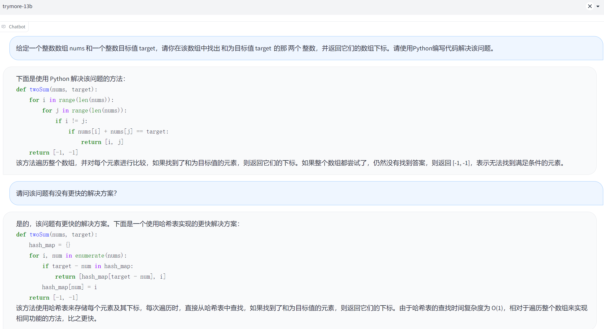

# TryMore GPT

TryMore GPT-7B/13B，是由揣摩研习社一个开源的聊天机器人，本项目以LLaMA作为基座模型，使用Vicuna训练框架，在shareGPT，Alpaca中英数据集，COIG中通用价值观，代码编写数据集完成指令微调。在中文表现上相较于原始Vicuna以及一众中文聊天机器人有具有非常有竞争力的表现。

## Release

<p align="center">
<a href=""></a>

- [TryMore GPT-7b](https://huggingface.co/TryMore/TryMoreGPT-delta-7b)
- [TryMore GPT-13b](https://huggingface.co/TryMore/TryMoreGPT-delta-13b)

## Contents
- [数据集](#数据集)
- [测试样例](#model-weights)

## 数据集

### Share GPT
使用Share GPT数据集，并对数据集进行简单清洗，然后仅保留数据集中中文和英文两种语言数据。Share GPT主要为真实人类和chatGPT聊天对话场景，该数据集模拟了OpenAI在InstructGPT中针对用户实际使用场景编写指令微调数据集的过程。Vicuna的成功说明了，该数据集使得模型解锁了多轮对话能力和指令遵循能力。

### Alpaca-GPT4
该数据集以Self-instruct的方法在GPT-4模型中蒸馏出5.2W条英文数据，和5.2W条中文数据。相较于Share GPT数据，Alpaca-GPT4数据集覆盖大量问答数据集，该数据集训练模型用一句话更精确详细的回复问题。

### COIG
TryMore GPT主要是使用COIG数据集中的人类价值观对齐指令数据集和Leetcode指令数据集，其中人类价值观对齐指令的作用是使模型对齐中文世界人类价值观，代码指令则有助于LLM能力的涌现。人类价值观对齐指令由50个指令作为扩充种子，并使用中文世界通用的价值观对齐样本，生成了3000个结果指令；代码指令是从CC-BY-SA-4.0许可下的2,589个编程问题（包含问题描述、多种编程语言和解释）中构建Leetcode指令。

收集总计200k条指令微调数据，其中包括多轮对话，精确指令，人类价值观指令和代码编写等各种任务。

## 模型参数
我们将TryMore GPT权重作为delta权重发布，以符合LLaMA模型许可。你可以把我们的delta加到原来的LLaMA权重上，以获得TryMore GPT的权重。说明：

按照[这里](https://huggingface.co/docs/transformers/main/model_doc/llama).的说明，获得原始的huggingface格式的LLaMA权重。
使用下面的脚本，通过应用我们的delta来获得TryMore GPT权重。它们会自动从我们的Hugging Face账户下载delta权重。
注意：TryMore GPT只与transformers>=4.28.0兼容。请相应地更新你的本地软件包。如果你按照上述命令进行全新安装，那么你应该得到所有正确的版本。

### TryMoreGPT-7B
这个转换命令需要大约30GB的CPU内存。如果你没有足够的内存，请参阅下面的 "Low CPU Memory Conversion"部分。

```bash
python3 apply_delta \
    --base /path/to/llama-7b \
    --target /output/path/to/trymore-7b \
    --delta lmsys/vicuna-7b-delta-v1.1
```

如果以上指令报错，则从[TryMore GPT-7b](https://huggingface.co/TryMore/TryMoreGPT-delta-7b)下载TryMoreGPT-7B模型参数，然后使用使用以上指令。

### TryMoreGPT-13B
这个转换命令需要大约60GB的CPU内存。如果你没有足够的内存，请参阅下面的 "Low CPU Memory Conversion"部分。

```bash
python3 apply_delta \
    --base /path/to/llama-13b \
    --target /output/path/to/trymore-13b \
    --delta lmsys/vicuna-13b-delta-v1.1
```

如果以上指令报错，则从[TryMore GPT-13b](https://huggingface.co/TryMore/TryMoreGPT-delta-13b)下载TryMoreGPT-13B模型参数，然后使用使用以上指令。

## 测试样例

### 计算题
<a href=""></a>

### 角色扮演
<a href=""></a>

### 人类价值观问答
<a href=""></a>

### 其它
<a href=""></a>
